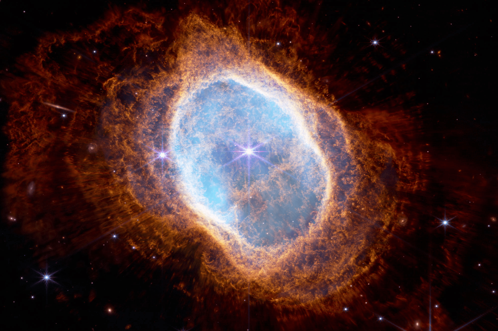

# Test page with test content

The James Web telescope is one of human greatest achivements

Table of content

- [History](#history)
- [Images](#images)
- [Code](#code)
- [Chapter with sections](#chapter-with-sections)
  - [subsection 1](#subsection-1)
  - [subsection 2](#subsection-2)

## History

There is some text to test, how it looks.

| Orders | Costs | Performance |
| ------ |-------|-------------|
| One  | 15 € | + 15 % |
| Two  | 65 € | + 55 % |
| Three  | 105 € | -16 % |
| Four  | 215 € | + 10 % |

## Images

<details>
<summary> To expand for image 1 click here </summary>

</details>

<details>
<summary> To expand for image 2 click here </summary>

</details>

## Code

```C++
#include <iostream>

int main(int argc, char* argv[])
{
    std::cout << "This is some example code" << std::endl;
}
```

## Chapter with sections

### subsection 1

### subsection 2
